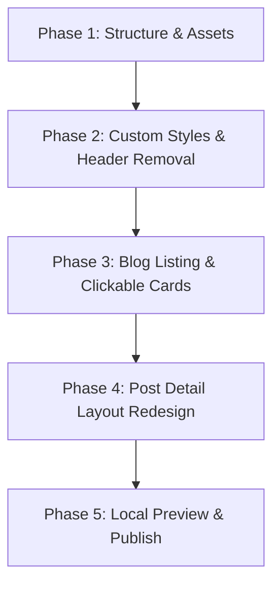

# Anveshaka: Project Plan & Objectives (Updated)

This document outlines the roadmap and details for building the **Anveshaka** website and blog, incorporating design updates to match the style, feel, and layout of `https://anveshaka.com` and a modern card-style footer inspired by `https://gourmet-tiramisu-24.aura.build/`.

---

## 1. Primary Objectives
* **Option 2 Rebuild**: Maintain a clean, fast Hugo site, removing Nicepage's 1.7 MB stylesheet overhead.
* **Exact Asset Migration**: Use the hero background image (`be90b7d5...jpg`), copy blocks, and contact links from `index.html`.
* **Refined Minimalist Styling**: 
  - **No assuming style preferences**: Keep styling clean, elegant, and quiet.
  - **Typography**: Playfair Display for headers, Inter/Open Sans for body paragraphs (replacing the loud Pacifico script font on homepage copy), and clean sans-serif for footer links (email).
  - **Hero Gap & Overlays**: Create a generous gap between the hero titles and the description block, matching the layout on the live site.
  - **Hero Overlays**: Keep the hero image bright by using a near-transparent overlay rather than a dark mask.
  - **Responsive Scaling**: Ensure the background image scales smoothly on zoom and window resize.
* **Blog Upgrades**:
  - Add a beautiful header cover image (`blog-header-bg.jpg`) to the blog feed page.
  - Make card images clickable.
  - Re-design the blog header and individual post containers to align with the best minimalist layouts (centered reading layouts, left-aligned titles, and `680px` content grids).
* **Card-Style Footer**: Redesign the footer as a modern, floating, rounded card at the bottom of the page (`rounded-2xl` corners, thin border, background padding) with email text styled in a clean sans-serif font.

---

## 2. Technical Stack
- **Static Site Generator**: Hugo
- **Layouts/CSS**: Custom, lightweight HTML templates and CSS variables (15 KB total).
- **Hosting**: Cloudflare Pages (integrated with GitHub)

---

## 3. Road Map

### Phase 1: Structure & Assets
* Clean up workspace.
* Copy premium header image and others from `Website Images/`.
* Configure Hugo site variables in `hugo.toml`.

### Phase 2: Custom Styles & Homepage Rebuild
* Remove "Anveshaka" title from navigation header, leaving navigation menu items only.
* Revise `assets/css/style.css`:
  - Change homepage paragraphs to a quiet sans-serif (Inter).
  - Remove dark hero masks, adjust hero paragraph spacing (`margin-top`).
  - Add responsive background cover scaling.
  - Redesign footer to use floating card styles (`margin`, `border-radius`, `border`, `bg-color`).
  - Change footer email font to standard sans-serif.

### Phase 3: Blog Listing Page Rebuild
* Redesign `layouts/_default/list.html` to integrate the beach header image.
* Make cards clickable by wrapping images in anchor tags.
* Apply grid gaps and modern styling to card headers.

### Phase 4: Post Page Layout Redesign
* Restructure `layouts/_default/single.html` for clean left-alignment.
* Bound the reading container width to `680px` for optimal typography.
* Ensure headings are contained and aligned within the grid.

### Phase 5: Local Preview & Deploy
* Review the local live site at `http://localhost:1313/`.
* Push to GitHub and deploy on Cloudflare Pages.
